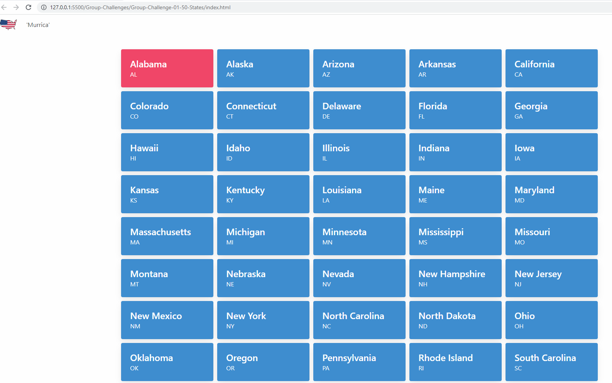

# Group-Challenge-01-50-States

## Description

We wanted out users to quickly see information about the 50 State of America.

## Installation

To install code, run the following command:
Git clone <paste SSH key>

## Deployed Link

https://sherryk1103.github.io/Group-Challenge-01-50-States/

## Usage

## Process Steps

1. Created a unique GitHub repo for this project.
2. Pseduocoded and delegated tasks
3. Created folder structure and relevant files.
4. Linked JavaScript, HTML, and Bulma
5. Set up Google Maps API and WikiPedia API's
